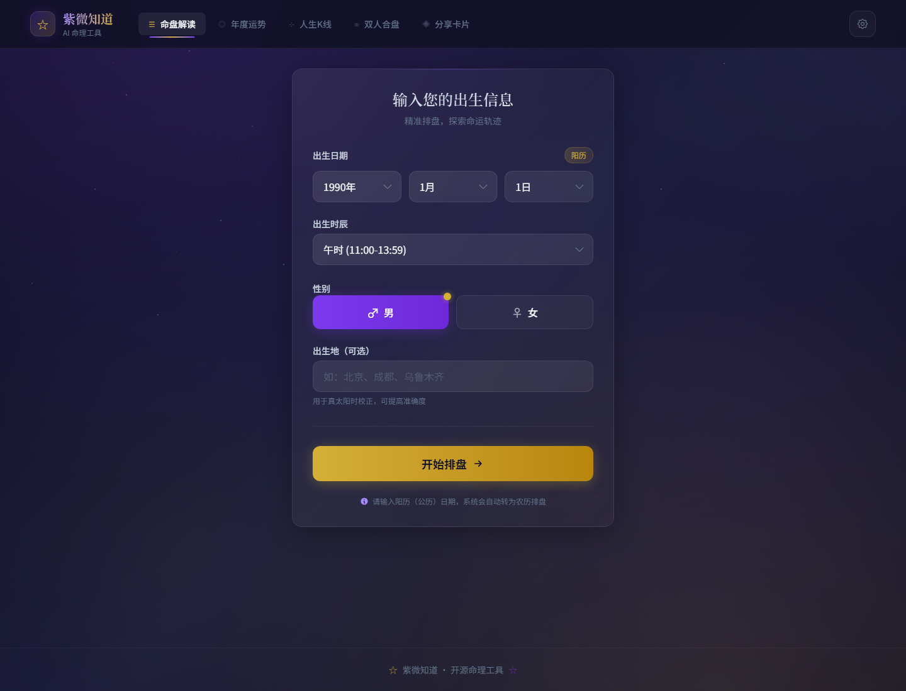

# OpenClaw Ziwei Studio | 互动排盘界面模板

A polished static capture of an interactive charting workflow: form input, state selection, mobile layout, and result-oriented interface design.

一个适合学习的互动工具界面模板：包含出生信息表单、选择控件、移动端布局、结果导向的交互流程和静态部署结构。

## 页面截图

下面两张图都是从本仓库真实页面生成的中文截图，方便快速判断项目实际效果。

| 页面截图 1 | 页面截图 2 |
|---|---|
|  |  |

## Why Star This | 为什么值得 Star

- A compact reference for building beautiful form-heavy tools without a heavy backend.
- Useful for astrology, questionnaire, calculator, onboarding, and result-generation products.
- Includes production-style static assets from a real interactive interface.
- 适合研究“输入信息 -> 生成结果”这一类工具型产品的首屏体验。

## What Is Inside | 项目内容

- `index.html`: static app shell.
- `assets/`: bundled CSS and JavaScript.
- `icon-192.png`, `favicon.*`: app icons.
- `docs/screenshot.png`: repository preview image.

## Best Use Cases | 适合做什么

- Interactive form products
- Static calculators and result pages
- Mobile-first landing tools
- Lightweight product prototypes
- 表单工具、测算页面、移动端交互原型、结果生成类产品

## Quick Start | 快速开始

Open `index.html` directly in a browser, or deploy the folder to any static hosting platform.

## Public Safety | 公开安全说明

Private deployment URLs, tokens, local state, and hosting identifiers were removed before publication.
