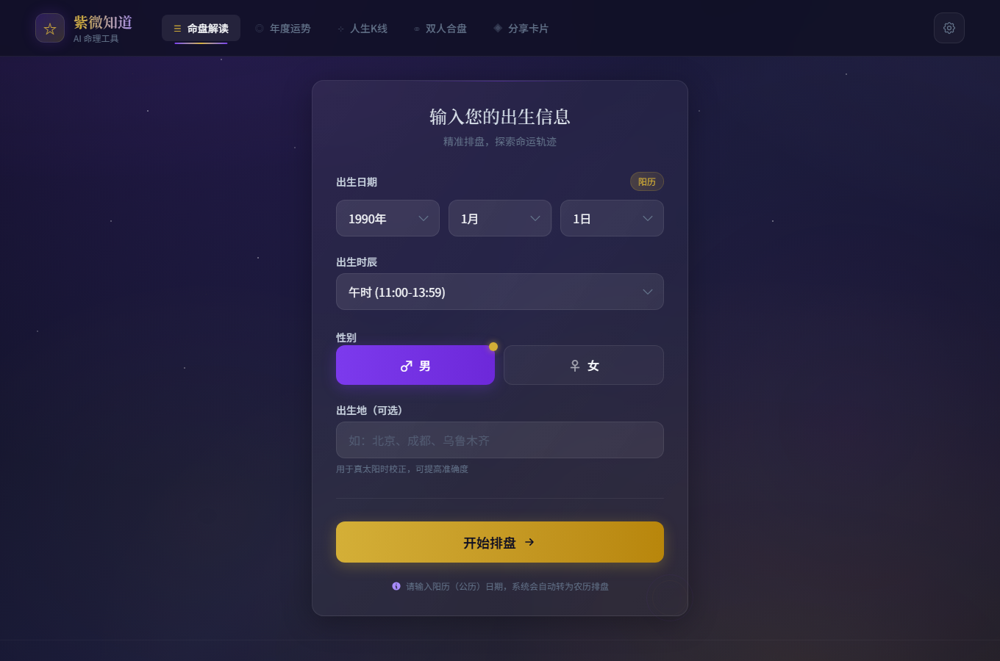
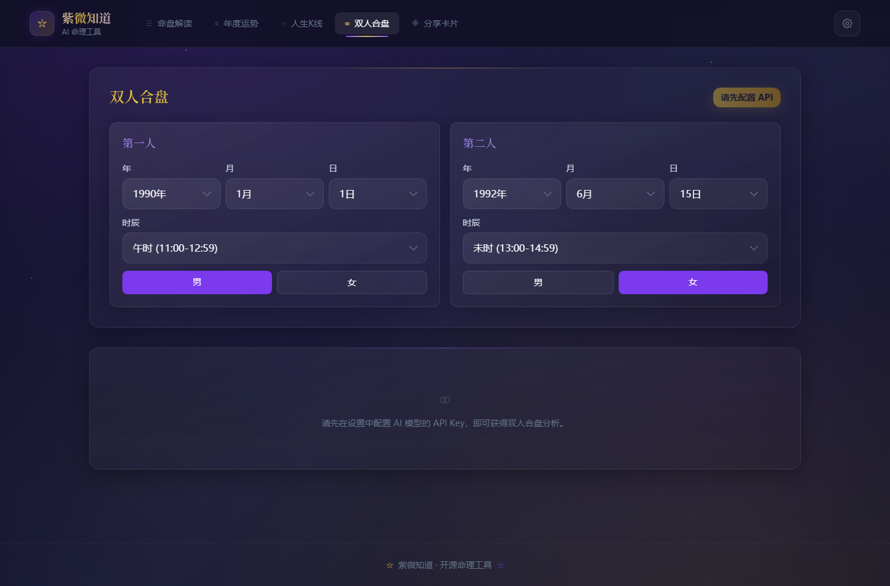
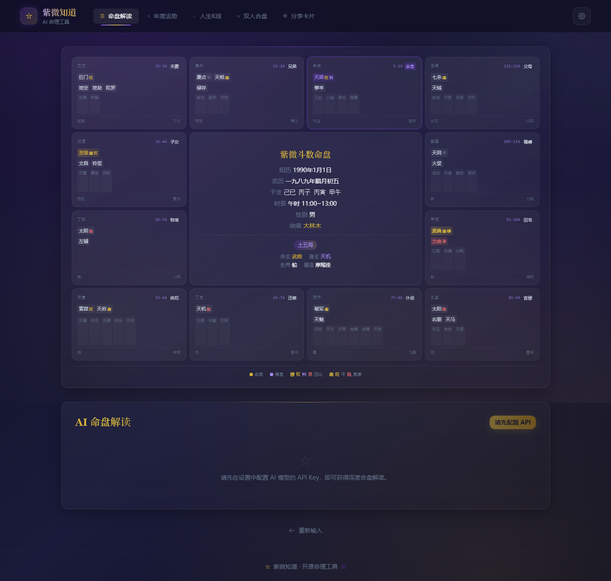

# OpenClaw Ziwei Interactive Tool Interface

A polished static frontend template for input-to-result tools, form workflows, mobile-first calculators, and interactive report products.

**中文介绍:** [README.md](README.md)

## At A Glance

**A polished input-to-result frontend template for calculators, forms, and generated reports.**

- Useful for calculators, questionnaires, AI reports, form-heavy products, and mobile-first interactive pages.
- Form flow, navigation, result screen, settings entry, and share-card structure are already in place.
- Reuse the visual system and input workflow for your own generated tool.

## Fork It In 30 Seconds

Fork it, replace the fields, logic, and result view, then ship your own interactive report product.

> If this saves you from rebuilding the same product skeleton later, consider starring the repo.

## Screenshots

The four screenshots below come from the actual rendered Chinese pages in this repository: the opening screen, the scrolled second screen, and two additional feature-focused views. They are real UI captures, not concept art or English placeholder mockups.

| Opening Screen | Scrolled Screen |
|---|---|
|  |  |
|  |  |

## What This System Does

This project preserves the frontend shape of a complete interactive tool. It is useful for studying how form-heavy products guide users from structured input to generated results.

## Core Features

- **Chart-reading entry screen** focused on birth date, birth time, gender, and optional birthplace.
- **Date selectors** for year, month, and day input.
- **Birth-time selector** for more complex structured form choices.
- **Gender segmented control** for clear binary-state selection.
- **Optional birthplace input** for future precision or location-based logic.
- **Primary result-generation action** through the start button.
- **Multi-module navigation** for chart reading, yearly fortune, life timeline, relationship chart, and share-card flows.
- **Settings entry point** for future theme, preference, sharing, or account features.
- **Mobile-first layout** that keeps the form focused and readable.
- **Static asset structure** with bundled CSS, JavaScript, icons, and favicon files.

## Good Fit For

- Astrology, Ziwei, or charting tools
- Questionnaire and diagnosis products
- Onboarding forms
- Calculator and result-page products
- Mobile interactive marketing tools

## Repository Structure

- `index.html`: static app entry.
- `assets/`: bundled CSS and JavaScript.
- `icon-192.png`, `favicon.*`: app and browser icons.
- `docs/`: screenshots and GitHub preview assets.

## Quick Start

Open `index.html` directly in a browser, or deploy the folder to any static hosting platform.

## Public-Safe Version

Private deployment URLs, production credentials, Cloudflare tokens, local environment files, logs, `.wrangler`, `node_modules`, and non-public material were removed before publication.

## Why Star This

Star this repository if you want a practical product pattern that can be studied, forked, customized, and turned into your own dashboard, content system, knowledge portal, or interactive tool.
